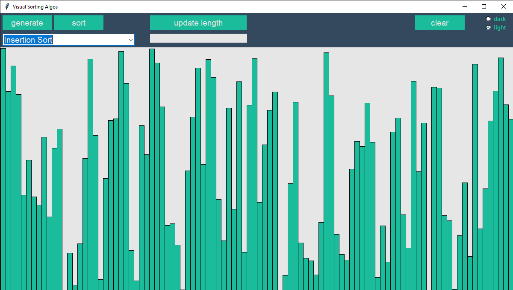

# Interactive-Visual-Sorting-Algorithms
Interactive, visual representation of various sorting algorithms using Python and Tkinter

In this project, I create a user interface for an interactive, visual representation for various sorting algorithms.

## Requirements:
* The program was created using **Python3.7**
* The UI was created using **Tkinter** (preinstalled with Python)

## Sorting:
A sorting algorithm is used to rearrange the elements of an array according to a specific comparision operator. For example, when dealing with numbers, one might want to sort numbers in ascending or descending order. 

## Algorithms:
* **Selection Sort** O(n^2)
* **Bubble Sort** O(n^2)
* **Insertion Sort** O(n^2)
* **Merge Sort** O(nlog(n))
* **Quick Sort** O(nlog(n))

## Features:
* **Generate random unsorted array**
* **Drop down menu to select the sorting algorithm**
* **Sort button** begins the sorting algorithm
* **Clear button** clears the screen
* **A visual representation** of the array and sorting process that updates in realtime.
* And finally no UI is complete without an inbuilt **dark color scheme** :smiley:

### Randomly generated unsorted array

### Sorting

### Dark mode

